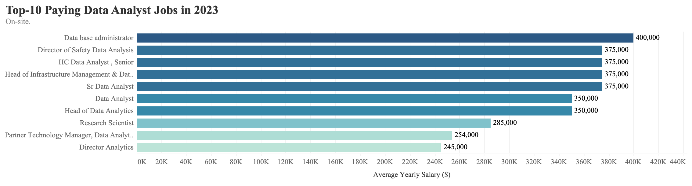

## Project Overview

This project serves as a practice aim using SQL and data visualization skills to analyze top-paid and in-demand skills of the data analyst job market in 2023.
The questions are be answered through my SQL queries are:
1. What are the top-paying data analyst jobs?
2. What skills are required for these top-paying jobs?
3. What skills are most in demand for data analyst?
4. Which skills are associated with higher salaries?
5. What are the most optimal skills to learn?

The dataset can be found [here](https://drive.google.com/drive/folders/1egWenKd_r3LRpdCf4SsqTeFZ1ZdY3DNx).

## Database Description
The database structure as seen below consists of four tables: company_dim, job_postings_fact, skills_dim, skills_job_dim, with a total row count of 787686 records.


## Tools I Used
- **SQL:** The backbone of my analysis, allowing me to query the database and unearth critical insights.
- **PostgreSQL:** The chosen database management system, ideal for handling the job posting data.
- **VS Code:** My go-to for database management and executing SQL queries.
- **Git & GitHub:** Essential for version control and sharing my SQL scripts and analysis, ensuring collaboration and project tracking

## Key Findings
### 1. Top paying data analyst jobs

To identify top-paying jobs, I filtered data analyst positions be average yearly salary and location, comparing remote & hybrid and on-site categories. Below query retrieves the top 10 data analyst related jobs for those remote & hybrid work types.
```sql
SELECT job_id,
       job_title, 
       job_title_short, 
       job_location, 
       job_posted_date :: DATE AS posted_date, 
       salary_year_avg, 
       company_dim.name AS company_name
FROM job_postings_fact
LEFT JOIN company_dim
ON job_postings_fact.company_id = company_dim.company_id
WHERE 
    job_location = 'Anywhere'
    AND job_title_short = 'Data Analyst'
    AND salary_year_avg IS NOT NULL
ORDER BY salary_year_avg DESC
LIMIT 10;
```



- **Wide salary range & gap**:
    - Top 10 data analyst jobs in both on-site and remote & hybrid job market show a broad salary range, spanning from $184,000 to $650,000 for on-site roles and $245,000 to $400,000 for remote & hybrid roles. This indicates significant earning potencial in the field.
    - Generally, on-site job positions offer higher average yearly salaries compared to remote & hybrid positions. A key factor behind this gap may be seniority levels - in both cases, half or more of the top roles carry titles like Seniors, Head, or Director. This pattern indicates a salary stratification within data analyst roles, where more senior, specialized, or managerial positions - particulary those on-site - are compensated at a premium level.
 
### 2. Skills for Top Paying Jobs
To undersand what skills are required for above top-paying jobs focusing on remote & hybrid type of work, I joined the job positings with the skills data, providing insights into what employers value for those high-compensation roles. 
```sql
with top_paying_jobs as (
    SELECT job_id,
        job_title, 
        job_title_short, 
        job_location, 
        job_posted_date :: DATE AS posted_date, 
        salary_year_avg, 
        company_dim.name AS company_name
FROM job_postings_fact
LEFT JOIN company_dim
ON job_postings_fact.company_id = company_dim.company_id
WHERE 
    job_location = 'Anywhere'
    AND job_title_short = 'Data Analyst'
    AND salary_year_avg IS NOT NULL
ORDER BY salary_year_avg DESC
LIMIT 10
)

SELECT 
    top_paying_jobs.*,
    skills_dim.skills
FROM top_paying_jobs
INNER JOIN skills_job_dim
    ON top_paying_jobs.job_id = skills_job_dim.job_id
INNER JOIN skills_dim
    ON skills_job_dim.skill_id = skills_dim.skill_id;
```

- SQL and Python are leading as the most in-demand skills, both required in 8 out of 10 roles.
- Tableau is also highly sought after, with a bold count of 9. Other skills like R, Excel and Power BI show varying degrees of demand.

### 3. In-Demand Skills for Data Analysts
To identify the skills most frequently listed in job postings for the Data Analyst role, I wrote the query below to focus on areas with high demand.
```sql
SELECT  skills,
        COUNT(skills_dim.skill_id) AS Skill_Count 
FROM job_postings_fact
INNER JOIN skills_job_dim
ON job_postings_fact.job_id = skills_job_dim.job_id
INNER JOIN skills_dim
ON skills_job_dim.skill_id = skills_dim.skill_id
WHERE job_title_short = 'Data Analyst'
GROUP BY skills
ORDER BY Skill_Count DESC
LIMIT 20;
```

- **SQL is the Most In-Demand Skill:** SQL is mentioned in over 92,628 job postings, making it the most essential skill for Data Analysts. This reflects its critical role in data extraction, manipulation, and querying from databases.
- **Excel and Python are Highly Relevant:** Excel remains a fundamental tool, while Python is increasingly favored for complex analytics and machine learning.
- **Visualization Tools are Key:** Tableau and Power BI are the leading data visualization tools, highlighting the growing demand for analysts who can present insights effectively.
- **Cloud and Database Skills are Emerging:** Skills like Azure (10,942 mentions), AWS (9,063 mentions), Oracle (10,410 mentions), and Snowflake (6,194 mentions) indicate the increasing demand for cloud-based data solutions and modern data warehousing platforms.

### 4. Skills Based on Salary
I also explored the average salaries associated with different skills, revealing which skills are the highest paying.
```sql
SELECT skills,
        ROUND(AVG(salary_year_avg), 0) AS Avg_salary
FROM job_postings_fact
INNER JOIN skills_job_dim
ON job_postings_fact.job_id = skills_job_dim.job_id
INNER JOIN skills_dim
ON skills_job_dim.skill_id = skills_dim.skill_id
WHERE job_title_short = 'Data Analyst'
AND salary_year_avg IS NOT NULL
GROUP BY skills
ORDER BY Avg_salary DESC
LIMIT 20;
```

- **Specialized and Advanced Tools Command Higher Salaries:**
  - Tools like SVN ($400,000), Solidity ($179,000), and Couchbase ($160,515) indicate that highly specialized or less common skills are associated with significantly higher salaries.
  - These tools are likely used in advanced or niche areas, such as blockchain (Solidity) or version control (SVN).
- **AI and Machine Learning Skills are Lucrative:** Skills like TensorFlow, Keras, PyTorch, and Hugging Face highlight the demand for expertise in AI and machine learning frameworks.
- **Big Data and Streaming Platforms:** Kafka and Cassandra indicate that expertise in big data and real-time streaming technologies is highly sought after.

### 5. Most Optimal Skills to Learn
Combining insights from demand and salary data, this query aimed to pinpoint skills that are both in decent demand (Skill_Count ≥ 20) and have high average salaries, offering a strategic focus for skill development. 
```sql
SELECT skills,
        ROUND(AVG(salary_year_avg), 0) AS Avg_salary,
        COUNT(skills_dim.skill_id) AS Skill_Count
FROM job_postings_fact
INNER JOIN skills_job_dim ON job_postings_fact.job_id = skills_job_dim.job_id
INNER JOIN skills_dim ON skills_job_dim.skill_id = skills_dim.skill_id
WHERE job_title_short = 'Data Analyst' AND salary_year_avg IS NOT NULL
GROUP BY skills
HAVING COUNT(skills_dim.skill_id) >= 20
ORDER BY Avg_salary DESC,
        Skill_Count DESC
LIMIT 20;
```


- **Skills with High Demand but Slightly Lower Salaries:** Some skills have **exceptionally high demand** but slightly lower average salaries. These skills are still optimal to learn because they are foundational for advanced roles and widely used across industries (Spark, Snowflake, Databricks, Pandas, Hadoop).
- **Niche Skills with High Salaries:** Some skills (PyTorch, TensorFlow, Phoenix, and Perl) have lower demand but exceptionally high salaries, indicating they are niche or specialized. Learning these can help differentiate you and open doors to specialized roles. For instance, both **PyTorch** and **TensorFlow** are frameworks for AI and machine learning, critical for transitioning into data science or ML engineering roles.
- **Skills Relevant to Cloud Platforms and Infrastructure:** Many skills in the list are tied to cloud platforms and data infrastructure, reflecting the growing demand for cloud-based analytics and distributed systems (GCP, Databricks, Snowflake, and Hadoop).
- **Skills for Data Processing and Automation:** Skills like Airflow, Pandas, and PySpark are critical for data processing, ETL pipelines, and automation. These skills are highly valued in roles requiring efficient handling of large datasets.

## What I Learned
Through this project, I gained valuable insights into the data analyst job market and honed my SQL and data analysis skills. Key takeaways include:
- **SQL Mastery:** Writing complex SQL queries to extract meaningful insights from a large dataset reinforced my understanding of joins, subqueries, and aggregate functions.
- **Data-Driven Decision Making:** By analyzing both salary and demand data, I learned how to prioritize skills that balance high earning potential with industry demand.
- **Market Trends:** I developed an understanding of the skills and tools driving the data analytics field in 2023, such as Python, SQL, Tableau, and cloud-based platforms like Snowflake and Databricks.
- **Specialization Matters:** Specialized skills like TensorFlow, PyTorch, and Kafka command higher salaries, highlighting the value of niche expertise.

## Conclusions
This project provided a comprehensive overview of the data analyst job market, helping identify the most in-demand and high-paying skills. The analysis revealed a clear demand for foundational skills like SQL, Python, and Tableau, which are essential for most roles. Additionally, cloud platforms, big data tools, and machine learning frameworks are becoming increasingly important for advanced and specialized roles.

For aspiring data analysts, focusing on a combination of high-demand foundational skills and niche, high-paying technologies is the most strategic approach to career growth. 
